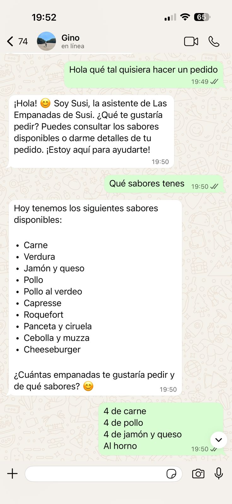
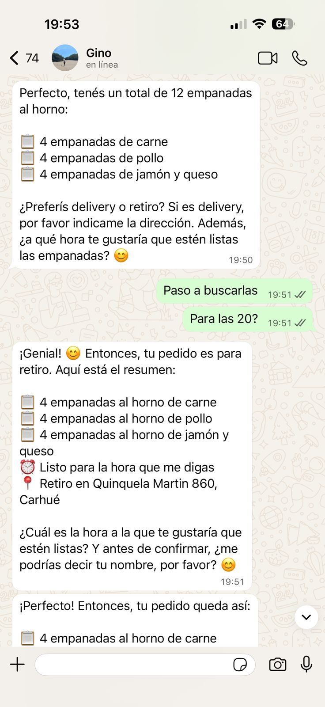
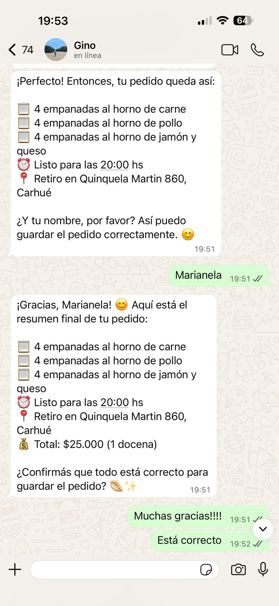
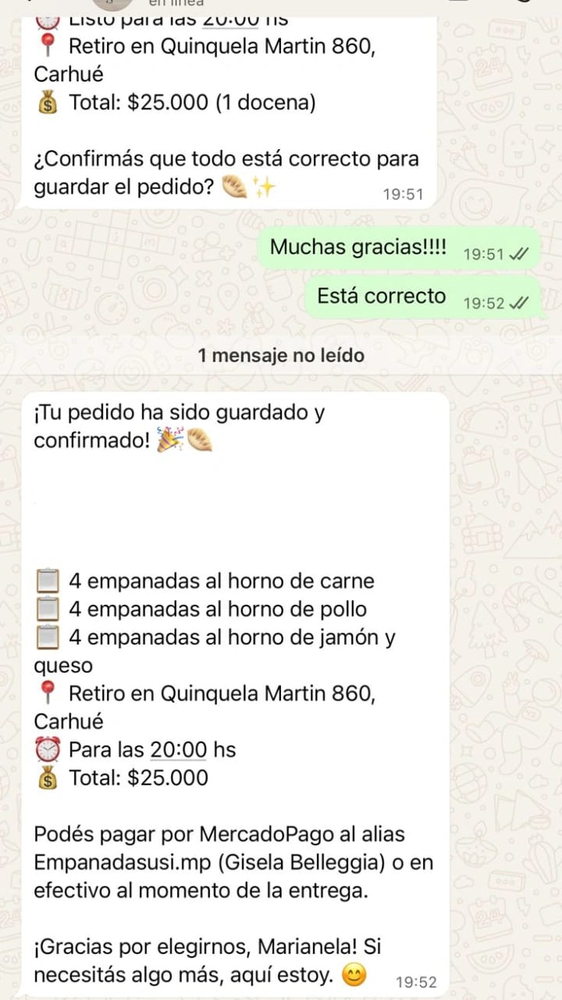

# Las Empanadas de Susi

Panel de gestion interno (PWA) + Bot de WhatsApp para toma de pedidos automatica, pensado para un emprendimiento de empanadas artesanales.

---

## App - Panel de gestion

| Inicio | Pedidos | Detalle de pedido |
|--------|---------|-------------------|
|  |  |  |

| Sabores | Precios | Estadisticas |
|---------|---------|--------------|
|  |  |  |

## Bot de WhatsApp (n8n)

| Paso 1 | Paso 2 | Paso 3 | Paso 4 |
|--------|--------|--------|--------|
|  |  |  |  |

El bot atiende clientes por WhatsApp via Evolution API, consulta los sabores disponibles en tiempo real desde Supabase, arma el pedido y lo guarda automaticamente en la base de datos, disparando una notificacion push al panel.

---

## Stack tecnologico

| Capa | Tecnologia |
|------|-----------|
| Frontend | Next.js 14 + TypeScript |
| Estilos | Tailwind CSS |
| Base de datos | Supabase (PostgreSQL + Realtime) |
| PWA | @ducanh2912/next-pwa + Web Push API |
| Graficos | Recharts |
| Bot | n8n (workflow en `n8n/`) |
| WhatsApp | Evolution API |

---

## Funcionalidades

- **Dashboard en tiempo real** - pedidos del dia, ingresos y alertas sonoras para nuevos pedidos via Supabase Realtime
- **Gestion de pedidos** - filtros por fecha (hoy / ayer / semana / rango), estado (pendiente / confirmado / cancelado) y busqueda por nombre
- **Administracion del menu** - activar/desactivar sabores, agregar, renombrar y eliminar; gestionar productos con precios
- **Estadisticas** - ingresos y cantidad de pedidos por periodo, top 3 sabores mas pedidos, grafico de pedidos por dia de la semana
- **Notificaciones push** - el panel recibe una push notification cuando llega un pedido nuevo, incluso con la app en segundo plano
- **PWA instalable** - funciona como app nativa en Android/iOS, con service worker y cache agresivo
- **Bot de WhatsApp** - atiende clientes, informa sabores disponibles, toma el pedido y lo registra en Supabase

---

## Arquitectura

```
WhatsApp
   |
   v
 n8n (workflow)
   |-- consulta sabores disponibles --> Supabase
   |-- guarda nuevo pedido ----------> Supabase
                                          |
                                     Realtime
                                          |
                                          v
                                    PWA / Panel
                                  (alerta + push)
```

---

## Setup

### 1. Variables de entorno

Copiá el archivo de ejemplo y completá los valores:

```bash
cp .env.example .env.local
```

| Variable | Descripcion |
|----------|-------------|
| `NEXT_PUBLIC_SUPABASE_URL` | URL del proyecto Supabase |
| `NEXT_PUBLIC_SUPABASE_ANON_KEY` | Clave anonima de Supabase |
| `SUPABASE_SERVICE_ROLE_KEY` | Clave service role (solo servidor) |
| `NEXT_PUBLIC_VAPID_PUBLIC_KEY` | Clave publica VAPID para Web Push |
| `VAPID_PRIVATE_KEY` | Clave privada VAPID (solo servidor) |

Para generar las claves VAPID:
```bash
npx web-push generate-vapid-keys
```

### 2. Instalar y correr

```bash
npm install
npm run dev
```

### 3. Bot de WhatsApp (n8n + Evolution API)

Importar el archivo `n8n/workflow.json` en tu instancia de n8n y configurar las credenciales de Evolution API y Supabase. El workflow recibe los mensajes via webhook desde Evolution API y responde por el mismo canal.

---

## Estructura del proyecto

```
app/
  page.tsx              # Dashboard (pedidos de hoy)
  pedidos/              # Historial con filtros
  menu/                 # Administracion de sabores y precios
  estadisticas/         # Graficos y metricas
  api/push/             # Endpoints para Web Push
components/             # Componentes reutilizables
lib/
  supabase.ts           # Cliente Supabase
  queries.ts            # Todas las queries a la base de datos
types/
  database.ts           # Tipos TypeScript del esquema
worker/
  index.ts              # Custom service worker
n8n/
  workflow.json         # Workflow del bot de WhatsApp
```
